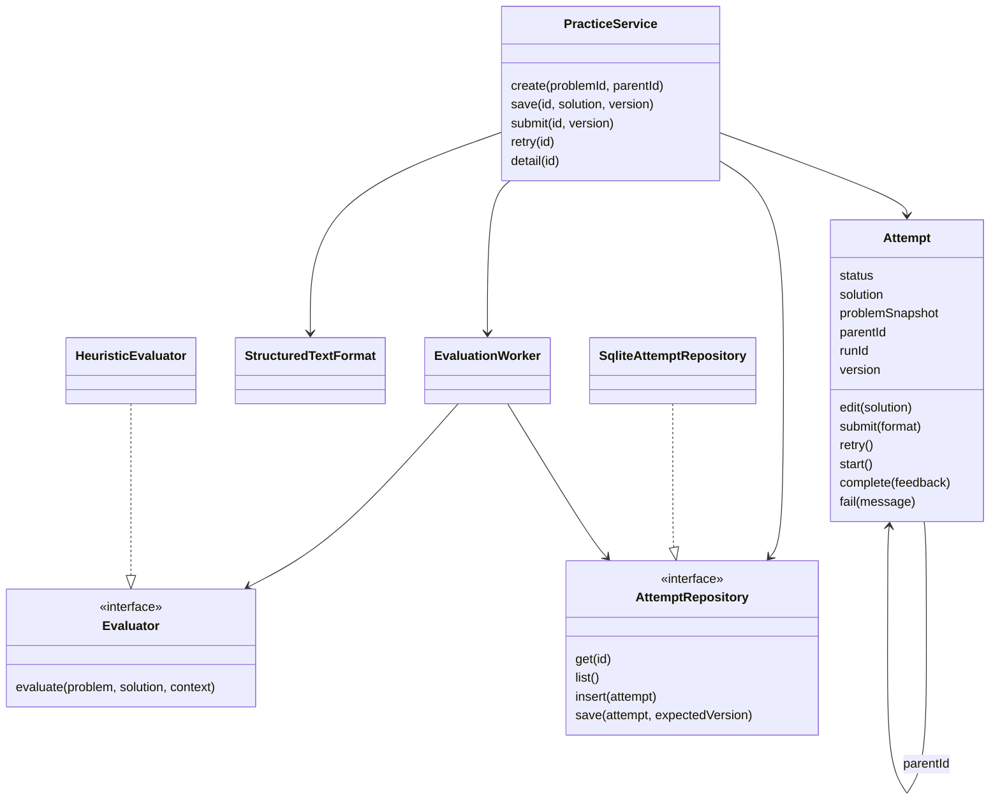
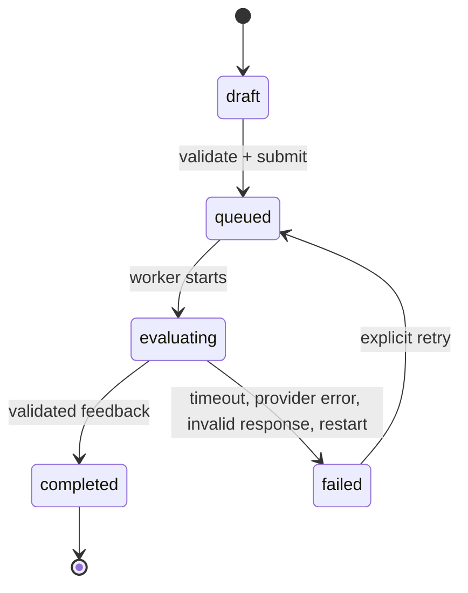

# Design note

## MVP and flow

Design Lab is a single-learner local monolith. The learner chooses one of three bounded LLD problems, writes a structured text design, saves a draft, submits it, receives an explainable review, and creates a linked revision. The product optimizes for understanding one decision better after each loop, not a ranking or a pass/fail verdict.

Required submission sections are scope/assumptions, objects/responsibilities and a behaviour walkthrough (at least 30 non-padding characters each). This is a minimal context check, not a semantic quality test. Relationships, trade-offs and tests are recommended; code/text diagrams are optional. Drafts can be incomplete. No submitted code executes.

## Domain responsibilities

| Object / interface | Owns | Deliberately does not own |
| --- | --- | --- |
| `Problem` catalog record | Version, requirements, constraints, extension scenario, review vocabulary | Attempt state or learner grades |
| `Attempt` aggregate | Draft/submission snapshot, legal state transitions, parent link, run token, timestamps | HTTP, SQLite queries, review algorithms |
| `StructuredTextFormat` | Input normalization, length/type limits, submission completeness | Semantic design evaluation |
| `PracticeService` | Create, save, submit, retry and revision use cases; invariant coordination | Storage implementation or feedback wording |
| Repository port / `SqliteAttemptRepository` | Retrieve/persist attempts and compare-and-swap writes | Domain transitions |
| `Evaluator` / `HeuristicEvaluator` | Convert a problem and canonical solution to a review | Mutating attempts or scheduling jobs |
| `EvaluationWorker` | Durable queue draining, timeout, provider validation, result publication, recovery | Deciding whether a design is good |
| HTTP adapter / browser | Input transport, rendered state, explicit saving, status polling | Authoritative lifecycle decisions |

The interfaces are JavaScript structural contracts with JSDoc, rather than empty abstract base classes. Tests inject alternate evaluators through the same contract. A repository contract is documented on the implementation. Domain classes have no browser or server dependencies.

## Invariants and lifecycle

- Only a draft accepts edits. Submission snapshots the problem and retains the solution. A revision deep-copies the solution into a new ID and references a completed/failed parent of the same problem.
- Each change increments `version`. SQLite updates include the expected version, so a second tab cannot overwrite a newer draft. Save and submit are synchronous atomic mutations within one Node process; the worker is the only asynchronous provider boundary.
- Repeated submit requests for an already submitted attempt return that attempt. Retrying an already queued/running attempt is also idempotent. Creating a draft is not idempotent across network retries; the UI disables concurrent actions, but a lost create response could leave an extra harmless draft.
- Each evaluation has a new run ID. Only the currently evaluating run can publish a result. Promise timeouts and token checks prevent late results from replacing the visible failure/retry state.
- One server process owns one database. On startup, previously evaluating attempts become failed with a retry message; durable queued attempts resume. A submitted solution survives a crash before the worker starts.

SQLite uses one JSON record per aggregate plus an indexed primary key and version column. That keeps snapshot evolution simple within the assignment. A normalized schema, migration framework and paginated indexed history would be warranted at higher volume; they are not claimed here.

## Evaluation: deterministic facts vs reasoning

There are two distinct kinds of checks:

1. **Deterministic enforcement:** format/type/size validation, minimum context, lifecycle legality, same-problem revision, optimistic locking, provider output shape, and exact quote membership. These are reliable application rules.
2. **Deterministic hints:** six field-specific phrase checks for responsibility ownership, collaboration, lifecycle, failure behaviour, trade-offs and tests. These locate text to discuss. A missing phrase may be a synonym; a present phrase may be a denial. These are expressly not semantic validation.

Every finding contains an ID, title, source section, `signal` or `review` status, exact excerpt or null, explanation and action. Three priorities are selected with missing signals first and remaining areas in a stable order. Failure prompts and change scenarios come from the specific problem. The UI surfaces the limitation alongside the findings, never calls the count a score, and does not reward pattern names.

This baseline provides bounded, useful self-review prompts without pretending to reason about code. Its main limitation is that action text is authored per review area/problem rather than tailored to every design. A human or LLM is more appropriate for cohesion, conflicting assumptions, inheritance suitability, transaction correctness and contextual trade-offs.

### Adding a reasoning evaluator

Implement `evaluate(problem, solution, { signal }) -> Promise<Feedback>` and inject it at the composition root. Keep credentials on the server. Include the exact brief, learner artifact and rubric version; treat the artifact as untrusted data, not instructions. Require structured output with exact evidence, qualified claims, alternative acceptable designs and at most three prioritized actions. `validateFeedback` rejects malformed output, unknown sections, duplicate finding IDs and invented quotes before storage. Merely validating JSON and quotes does not ensure truth: expert calibration and adversarial examples remain necessary.

Use the existing timeout and AbortSignal, disclose the provider and model/version, and preserve an explicit failed review rather than silently presenting deterministic feedback as AI. Compare reviews only with matching evaluator/rubric versions. A provider SDK is intentionally absent from this prototype: there was no validated semantic benchmark or supplied credential.

### Another format

Add an adapter that normalizes a new format into a versioned canonical artifact, then route by the attempt's format ID in `PracticeService`. The current adapter is injected, but the attempt factory defaults to `structured-text-v1`; a second real format requires extending that factory and the renderer. A code/diagram evaluator must not silently apply prose heuristics to AST nodes or diagram coordinates. Parsing/upload support is a future increment, not an existing feature.

## Delay, failure and scale

Submission returns 202 after durable queueing. The browser polls about once a second while the attempt is queued/evaluating and stops at a terminal state or on navigation. The worker processes jobs serially with a 10-second timeout; failures preserve the artifact and show a retry button. Provider errors are not leaked to the learner. The optional failure demo exercises this flow without an external service.

A blocked synchronous evaluator cannot be interrupted by a JavaScript timer; new expensive CPU evaluators should use worker threads. An asynchronous provider must respect AbortSignal to release resources. There is no automatic retry storm, broker, Kubernetes, or multi-region design. For more local usage, index/paginate history and bound queue length. For a hosted product, add authentication/ownership, rate limits and a managed persistent database before exposing the service. A separate worker is only necessary once measurements justify it.

## Engineering trade-offs

The browser uses vanilla modules and semantic HTML; the server uses Node's HTTP and SQLite APIs. Zero installed dependencies make setup and offline demos predictable, while accepting that Node 22's SQLite API is experimental. Strict localhost binding, a static asset allowlist, CSP, escaped learner text, bounded JSON input and cross-origin write rejection fit the local threat model. They are not a substitute for authentication.

The prototype favours explicit saved drafts over continuous autosave, a notebook over a drawing canvas, and honest review prompts over an uncalibrated numeric grade. The next validation task is measuring whether learners can explain an improved design decision after the second attempt.
